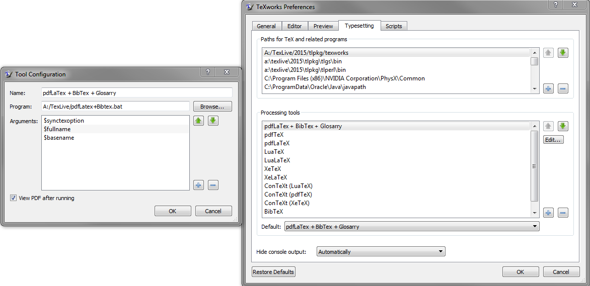

# Thesis-TUe
Contians a template for the Thesis at the University of Technology Eindhoven. Feel free to remove certain aspects you do not like (e.g. the soft cover). 

# Table of Contents

- [Use](#use)
- [How to Run the Build Script?](#how-to-run-the-build-script)
- [Important Notes](#important-notes)
- [Questions, suggestions and / or remarks?](#questions-suggestions-and-or-remarks)

# Use
Just download the template and start typing away or make use it as intended and allow for easy updates.

The best use would be to use change the files in the Report folder. The Report.tex file is the main file, which need to be run to get output, and does not need any modifications. You could use another folder for your report, like another GIT repo, in that case copy the contents of the Report folder to the desired location. Keep in mind that updates, might be done to some of those files.

The following files are your customization points:
- report_contents.tex > contains the actual links to other files. Use this to modify the contents
- report_definitnios.tex > use this file for your custom definitions
- report_packages.tex > use this file for your added packages
- report_specifics > use this file to tweak the template and to fill in details the template needs (like supervisor).

# How to Run the Build Script?
## Using TexLive and TexWorks
I created a build script that makes the file completely. This means it makes the content and makes sure that all references are also correct (among others: the table of contents is up-to-date, the references are all present, the references point to the proper page).

NOTE: You need to change the internal structure of the build script to point to your installation directory (of texlive)

To add this script in TexWorks, go to "Edit" -> "Preferences" -> "Typesetting". Then on the bottom frame press the "+" to add a processing tool. As arguments add the following
- $synctexoption
- $fullname
- $basename

## Using MiKTeX and TeXMaker
1. Obtain a version of MiKTeX from [here](https://miktex.org/download). In case you don't have an admin account on your laptop, you can get [MiKTeX portable](https://miktex.org/download#collapse228).
2. Install MiKTeX. In case of MiKTeX portable, make sure that you add to your user's `PATH` system variable the location of MiKTeX's portable `bin` folder.
3. Open the file `Report.tex` in TeXMaker.
4. Go to `Options>Configure Texmaker` and then to `Quick Build`.
5. In the `User:` command definition, you need to define the following command of execution:`pdflatex -interaction=nonstopmode -synctex=1 %.tex|bibtex %|makeindex %.idx|makeglossaries %|pdflatex -synctex=1 -interaction=nonstopmode %.tex|pdflatex -synctex=1 -interaction=nonstopmode %.tex`
6. Enjoy writing in LaTeX.

**Remark:** If you **do not** set the `PATH` variable (as described in Step 2), then you need to specify manually the path of each executable of the previous command. For instance, this would look like: `"C:/Users/user/miktex/texmfs/install/miktex/bin/pdflatex.exe" -interaction=nonstopmode -synctex=1 %.tex|"C:/Users/user/miktex/texmfs/install/miktex/bin/bibtex.exe" %|makeindex %.idx|makeglossaries %|"C:/Users/user/miktex/texmfs/install/miktex/bin/pdflatex.exe" -synctex=1 -interaction=nonstopmode %.tex|"C:/Users/user/miktex/texmfs/install/miktex/bin/pdflatex.exe" -synctex=1 -interaction=nonstopmode %.tex`

# Important Notes
## Soft cover Logos
THe logos on the soft cover (from company and TU/e) need to be of the same size (perceived to be equally big). To facilitate this there are commands added in the report_specifics.tex to faciliate tweaking of the widths and heights of these logos. 

## Colors
The file colors.tex contains all the colors that are defined in the report. The reason that it is in a separate file is that you can easily reuse the colors across all your images and documents. Thereby making everything consistent and there is only one point of change.

The colors.tex also contains the colors that are used for hyperlinks, cites and other cross references. Please update the color of those in this file and not in the reporttheme.sty.

## BibTex
The BibTex can be placed anywhere you like, but for reuse I put it next to the colors.tex file. This is also what the template expects.

## Glossary terms and Acronyms
This is a specific file that can be reused and is therefore also placed along the bibliography and colors file.

# Questions, suggestions and / or remarks?
Please contact Colin or make an issue here.

# Contributors
- Colin Lambrechts
- Epameinondas Rontogiannis
- Thom Castermans
- Willem Sonke
- Joos Buijs
- Thijs Nugteren